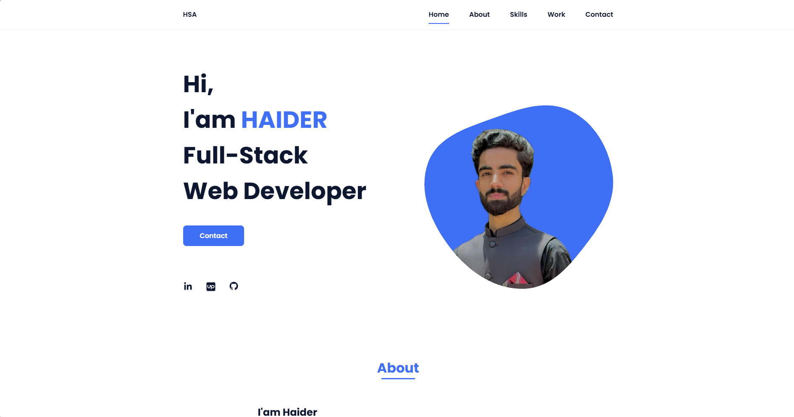

# HSA's Portfolio Website

Link: https://hsa-attock.github.io/personal-portfolio-hsa/

This is a fully responsive personal portfolio website built with HTML, CSS, and JavaScript. It showcases my projects, skills, contact form, and social links. This portfolio is perfect for sharing your development work and connecting with potential clients or employers.

##  Live Demo

You can deploy this project using GitHub Pages, Vercel, or Netlify. Or serve it locally with Node.js (see below).

## 📸 Preview



##  Folder Structure

```

├── assets/             # Frontend files (CSS, JS) and images
│   ├── css/
│   │   └── style.css
│   ├── img/
│   │   ├── perfil.png # my main image
│   │   ├── work.jpg   # skills section image
│   │   ├── work1.jpeg # Figma Email Design image
│   │   ├── work2.jpg  # WebRTC Video Chat image
│   │   ├── work3.png  # Chat App image
│   │   ├── work4.png  # Paragraph Analyzer image
│   │   └── work5.jpg  # Login Form image
│   ├── js/
│   │   └── script.js
├── index.html
├── package.json        # Project manifest
├── server.js           # Node.js backend server
├── preview.png         # Website's screenshot for preview
└── README.md           # This documentation file

````

##  Features

- Modern, clean, and responsive layout
- Smooth scroll navigation and section highlighting
- Contact form integration using [FormSubmit](https://formsubmit.co/)
- Scroll reveal animations
- Social media links (LinkedIn, Upwork, GitHub, Instagram, Facebook)
- Mobile-friendly layout

##  Technologies Used

- HTML5
- CSS3 (custom design, media queries)
- JavaScript (vanilla)
- ScrollReveal.js for animations
- Boxicons & Font Awesome
- Node.js + Express (optional for local hosting)

##  Installation

To run this project locally:

```bash
git clone https://github.com/HSA-ATTOCK/personal-portfolio-hsa.git
cd personal-portfolio-hsa
npm install
node server.js
````

Then visit: [http://localhost:5000](http://localhost:5000)

Or use:

```bash
npx ngrok http 5000
```

To share a public URL.

##  Contact Form

Powered by **FormSubmit**. To use it:

* Make sure your email is set correctly in the form action or fetch URL.
* Test it live (won’t work on `file://` or localhost directly without backend or AJAX).

##  Responsive Design

Mobile layout is optimized using media queries. On small screens, the sections stack vertically, and images and buttons are rearranged for best readability.

##  Credits

* ScrollReveal for animations
* Boxicons and Font Awesome for icons
* FormSubmit for contact handling

##  License

This project is open source under the [MIT License](LICENSE).

---

###  Author

**Haider Sajjad Azmat (HSA)**

---
